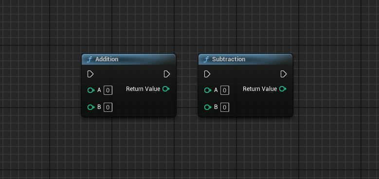
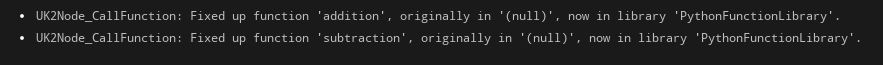

# Create blueprint library (nodes) with python

# Knowledges
Nodes created with Python only work in the editor — not at runtime!

## Supported
- Unreal Engine types (e.g., `unreal.Vector`, `unreal.StaticMesh`, etc.)
- Multiple inputs

## Not supported yet
- Multiple outputs

# Tips
This message simply means that Unreal automatically reconnected your Python function to the new library after the link had previously been broken. This is normal behavior when creating Blueprint nodes with Python.

If your nodes are broken when the engine starts, it means Unreal didn't initialize your module in time.
It's important to load your function library module from an `init_unreal.py` file, which will be executed automatically at engine startup.
